# 1. Kịch bản thực tế (Scenario)
Giả sử người dùng gửi một câu hỏi cho AI Agent hỗ trợ chăm sóc khách hàng:

> User: "Tôi muốn đổi trả sản phẩm đơn hàng #12345 thì làm thế nào?"

Một Trace đại diện cho toàn bộ hành trình (End-to-End flow) mà hệ thống xử lý để đưa ra câu trả lời cho câu hỏi trên.

# 2. Trace Hierarchy

### Flow tổng quan


### Trace Waterfall (Thác nước)

```mermaid
gantt
    title 🔎 Trace — Agent Process Order Return (2.85s | $0.0032)
    dateFormat X
    axisFormat %s s

    section 🛡️ Guardrail
    Span 1 · Guardrail Check                :active, g1, 0, 120

    section 🔍 RAG
    Span 2 · RAG Retrieval                  :active, r1, 120, 450
    ├─ Embedding Query                      :crit,   r2, 120, 80
    └─ Vector Search · Pinecone             :        r3, 200, 370

    section 🧠 LLM
    Span 3 · LLM Reasoning & Tool Call      :active, l1, 570, 1200
    └─ Call GPT-4o (450 tokens)             :crit,   l2, 570, 1200

    section ⚙️ Tool
    Span 4 · Fetch Order Details            :active, t1, 1770, 680
    └─ GET /api/v1/orders/12345             :crit,   t2, 1770, 680

    section 💬 Answer
    Span 5 · Final Answer Generation        :active, a1, 2450, 400
    └─ Call GPT-4o-mini (210 tokens)        :crit,   a2, 2450, 400
```



### Trace Tree (Chi tiết)

```
[Trace] Agent Process Order Return
│       ⏱ Tổng thời gian: 2.85s │ 💰 Cost: $0.0032
│
├── 🛡️ [Span 1] Guardrail Check ·························· 0.12s
│
├── 🔍 [Span 2] Retrieval Augmented Generation (RAG) ····· 0.45s
│       ├── [Generation] Embedding Query ·················· 0.08s
│       └── [Span]       Vector Search — Pinecone ········· 0.37s
│
├── 🧠 [Span 3] LLM Reasoning & Tool Call ················ 1.20s
│       └── [Generation] Call GPT-4o ······ 1.20s │ 🪙 450 tokens
│
├── ⚙️ [Span 4] Execute Tool — Fetch Order Details ······· 0.68s
│       └── [API Call]   GET /api/v1/orders/12345 ········· 0.68s
│
└── 💬 [Span 5] Final LLM Answer Generation ·············· 0.40s
        └── [Generation] Call GPT-4o-mini · 0.40s │ 🪙 210 tokens
```

# 3. Trace Payload

## A. Span: RAG Retrieval (Tìm kiếm tri thức)
- **Input**: `"chính sách đổi trả sản phẩm"`

- **Output**: Chiết xuất đoạn văn bản phù hợp từ cơ sở dữ liệu:

> "Chính sách: Khách hàng được đổi trả trong vòng 7 ngày kể từ khi nhận hàng..."

- **Metrics**: Top-k = 3

## B. Span: LLM Call (Giai đoạn suy luận)
- **Model**: gpt-4o

- **Input (Prompt)**:

    - **System**: "Bạn là trợ lý CSKH. Dựa vào thông tin chính sách và dữ liệu đơn hàng để hỗ trợ..."

    - **Context**: "Chính sách đổi trả 7 ngày..."

    - **User**: "Tôi muốn đổi trả sản phẩm đơn hàng #12345 thì làm thế nào?"

- **Output**: Tool Call: `fetch_order_status(order_id="12345")`

- **Metrics**:

    - Time to First Token (TTFT): 0.35s

    - Total Tokens: 450 (Prompt: 380, Completion: 70)

    - Cost: $0.0022

## C. Span: Tool Execution (Gọi API hệ thống)
- **Function**: `fetch_order_status`

- **Parameters**: `{"order_id": "12345"}`

- **Response**: 
```json
{"status": "delivered", "delivery_date": "2026-08-05", "eligible_for_return": true}
```

# 4. Trace giải quyết vấn đề gì? (Value of Tracing)
Nếu câu trả lời trả về cho người dùng bị sai hoặc phản hồi quá chậm (mất 5 giây), Trace Waterfall (dạng thác nước) giúp kỹ sư nhìn thấy ngay lập tức:

**1. Phát hiện Bottleneck (Điểm nghẽn):**

Nếu thấy **Span 4 (Fetch Order Details)** mất tận `3.8s` trong tổng số `5s`, nguyên nhân chậm do **API hệ thống backend/database bị nghẽn**, không phải do LLM.

**2. Debug lỗi sai logic (Logic Hallucination):**

Nếu Agent từ chối đổi trả, mở Trace ra kiểm tra thấy ở Span 4 API trả về `eligible_for_return: true`, nhưng ở Span 5 LLM lại đọc sai dữ liệu thành `false`. Từ đó kỹ sư biết cần điều chỉnh lại **Prompt Instruction** ở bước cuối.

**3. Kiểm soát chi phí (Cost Tracking):**

Trace hiển thị chính xác lượt request này tốn $0.0032, tổng cộng 660 tokens, giúp phát hiện các prompt bị phình to dung lượng không cần thiết.